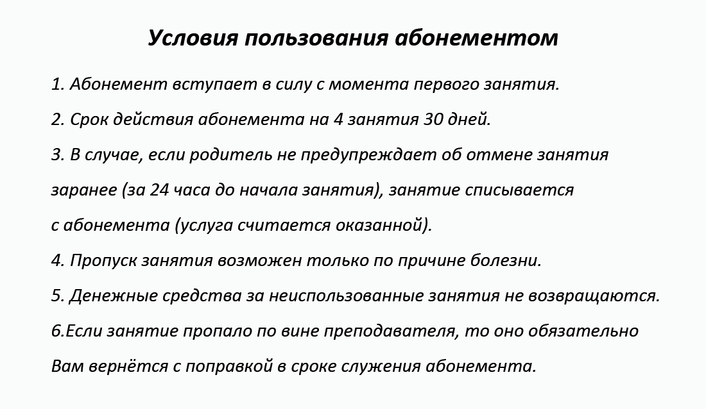

# Инструкция для работы с Markdown

## Выделение текста

Чтобы выделитт текст курсивом необходимо обрамить его звездочкой (*) или знаком нижнего подчеркивания Например: *вот так* или _вот так_

Чтобы выделить текст полужирным необходимо обрамить его двумя звездочками (**) или двойным знаком нижнего подчеркивания Например **вот так** или __вот так__

Альтернативные способы выделения текста жирным или курсива нужны для того, что бы мы могли совмещать оба этих способа. Например: _текст может быть выделен курсивом и **полужирным**_

## Списки

Чтобы добавить ненумерованные списки необходимо пункты вывделить звездочкой. Например вот так:
* Элемент 1
* Элемент 2
* Элемент 3

Чтобы добавить нумерованные списки необходимо пункты просто пронумеровать. Например вот так:
1. Первый
2. Второй

## Работа с изображениями

Чтобы вставить изображение в текст достаточно написать следующее:

## Ссылки

## Работа с таблицами

## Цитаты

## Вывод

test
y = y + 1
print(y)